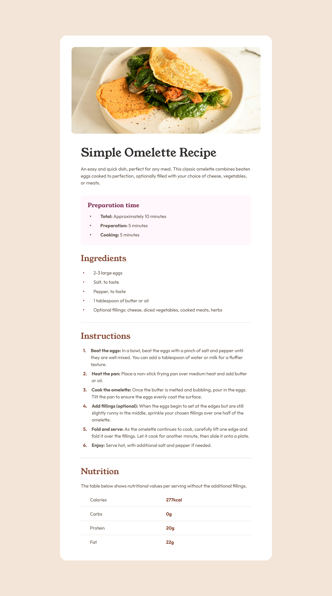

# Frontend Mentor - Recipe page solution

This is a solution to the [Recipe page challenge on Frontend Mentor](https://www.frontendmentor.io/challenges/recipe-page-KiTsR8QQKm). Frontend Mentor challenges help you improve your coding skills by building realistic projects. 

## Overview

### Screenshot

### Links

- Solution URL: [GitHub](https://github.com/ArunBohra12/recipe-page)
- Live Site URL: [GitHub Pages](https://arunbohra12.github.io/recipe-page)

## My process

### Built with

- HTML
- CSS

## Author

- Website - [Arun Bohra](https://arun-bohra.com)
- Frontend Mentor - [@ArunBohra12](https://www.frontendmentor.io/profile/ArunBohra12)
- Twitter - [@ArunBohra122](https://www.twitter.com/ArunBohra122)

